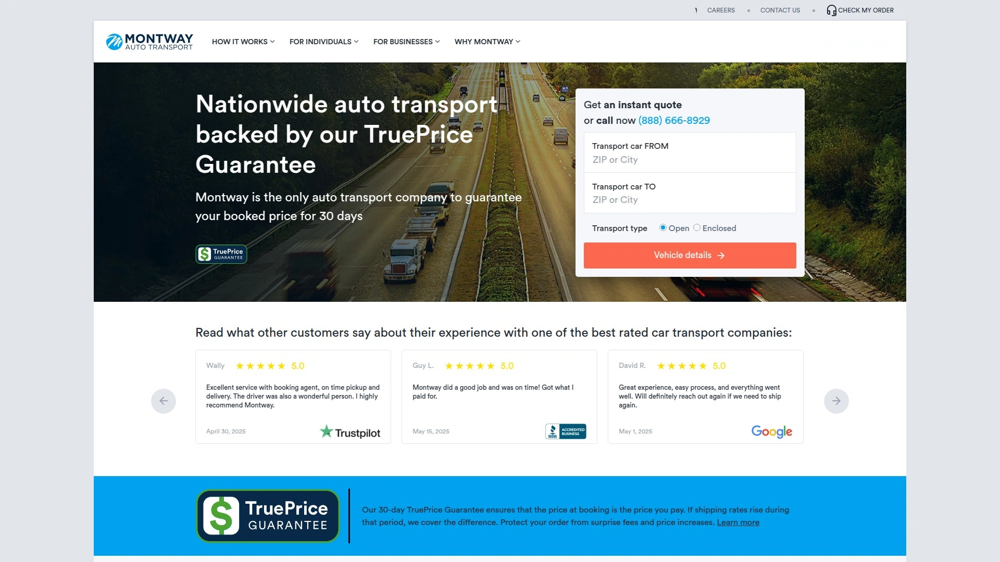
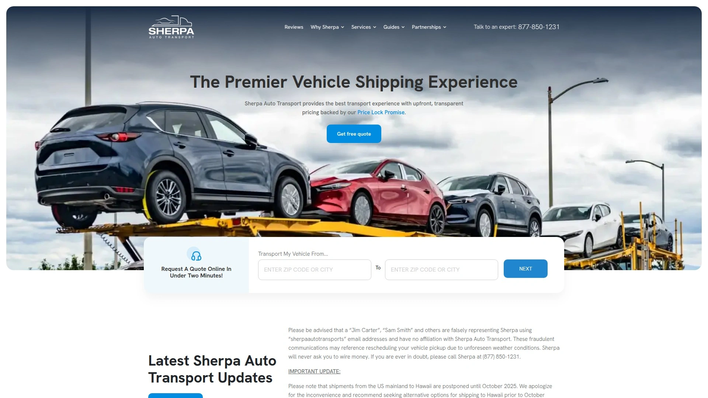
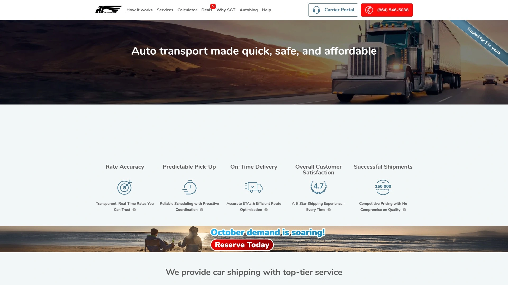
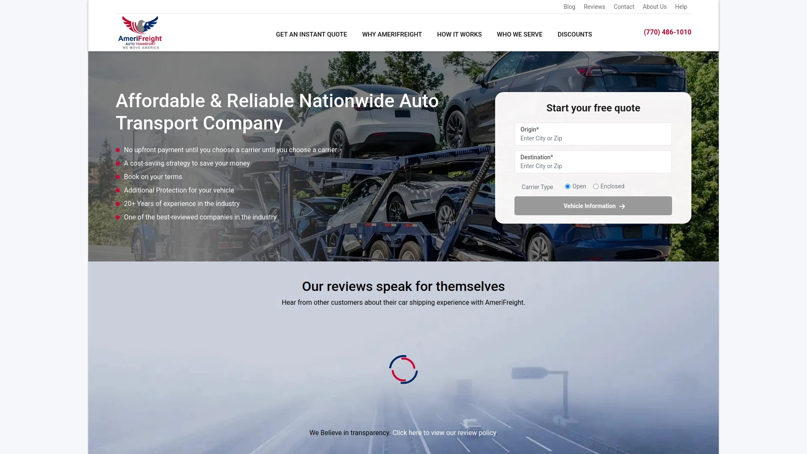
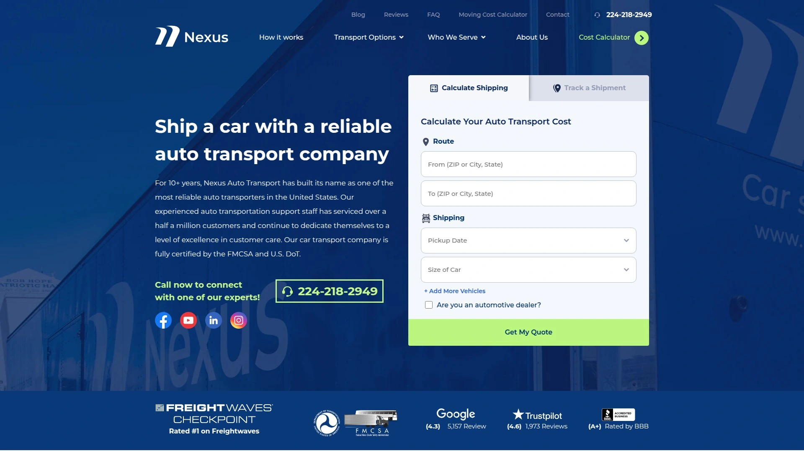
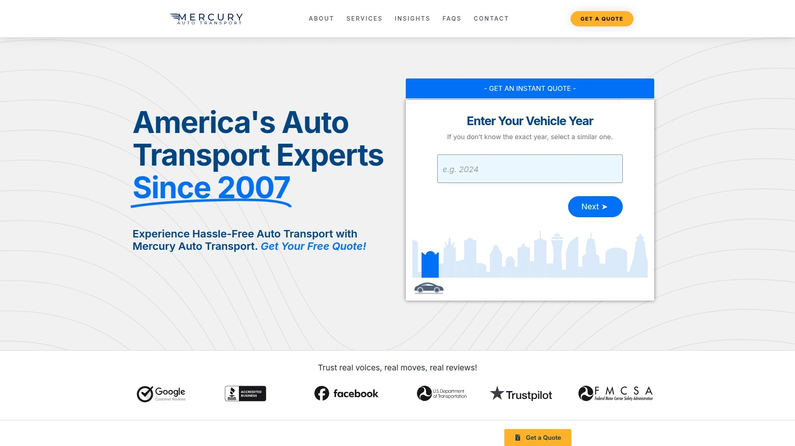
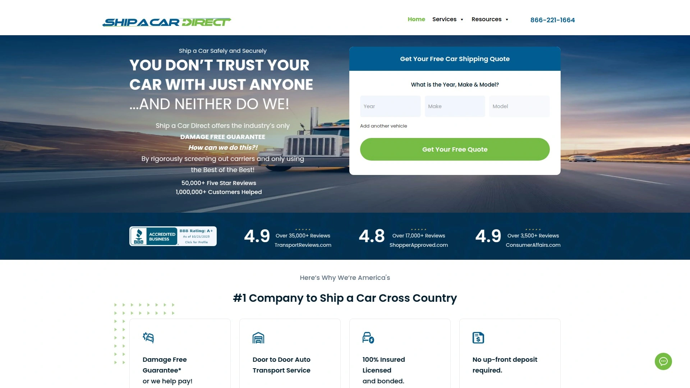
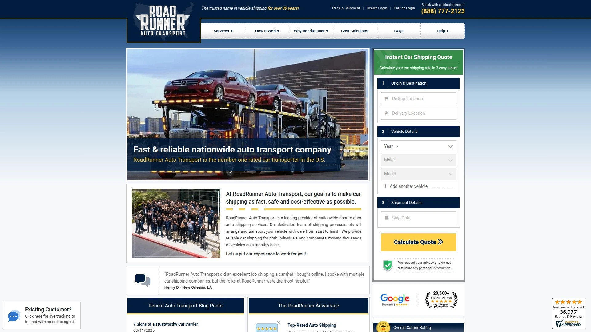
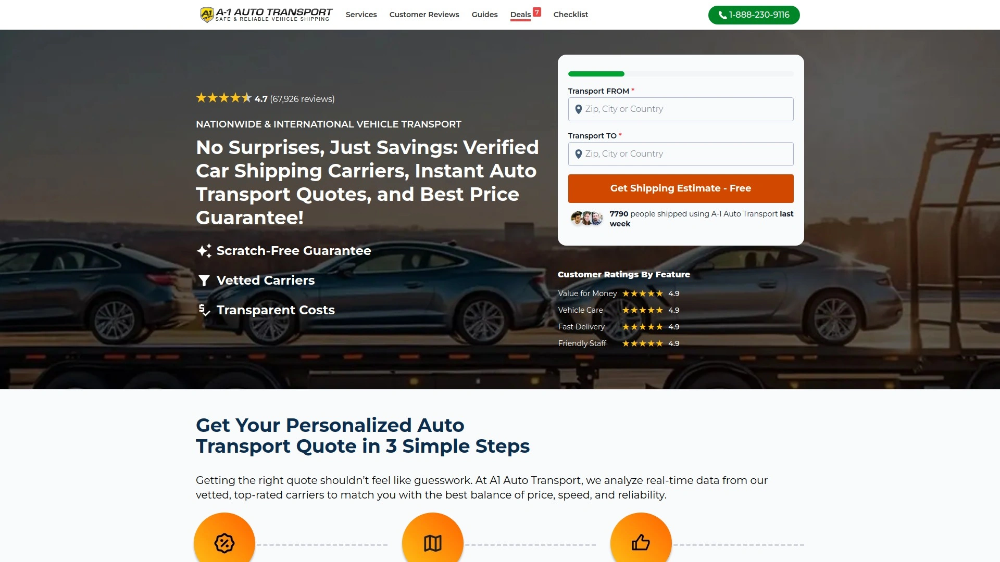

# 2025's Top 10 Best Nationwide Auto Transport Services

Moving your car across state lines used to mean endless phone calls, price uncertainties, and days of waiting. Modern auto transport platforms have changed the game completely. Whether you're relocating for work, buying a vehicle online, or heading south for the winter, the right car shipping service gets your vehicle there safely without the hassle. These platforms handle everything from coast-to-coast moves to Alaska and Hawaii deliveries.

## **[Montway Auto Transport](https://montway.com)**

The industry leader with guaranteed pricing protection.

Montway stands out with its TruePrice Guarantee, a unique protection that locks in your booked price for 30 days even if market rates climb. This means no surprise charges or last-minute price increases that plague the industry. Since 2007, they've shipped over one million vehicles to all 50 states, building one of the most extensive carrier networks in North America.

Their instant quote calculator gives you accurate estimates immediately, showing both open and enclosed transport options with transparent pricing. You can ship everything from standard sedans to motorcycles, boats, RVs, and ATVs. Door-to-door service handles pickup and delivery as close to your location as legally possible, and you can put up to 100 pounds of personal items in the trunk during transport. Military members get special discounts, and there's no upfront payment required. The company carries additional cargo insurance up to $250,000 beyond the carrier's policy, providing extra peace of mind. Their expedited service guarantees pickup dates when timing matters most.

## **[Sherpa Auto Transport](https://www.sherpaautotransport.com)**

Price Lock Promise keeps your costs predictable.

Founded in 2017 after the owner's frustrating shipping experience, Sherpa built its reputation on transparent pricing and excellent communication. Their Price Lock Promise ensures that if they can't find a carrier at your quoted price, they'll contribute up to $300 to maintain the agreed rate. You also get a free car wash when your vehicle arrives at its destination.

The company focuses exclusively on cars, SUVs, pickup trucks, and vans, allowing them to specialize deeply in passenger vehicle transport. They accept credit card payments and require no deposit upfront to schedule your shipment. Every transport includes $100,000 in cargo insurance, and they'll even ship inoperable vehicles as long as they can brake, roll, and steer. Their customer-focused approach has earned them an A+ BBB rating despite being newer than many competitors.

## **[uShip](https://www.uship.com)**

Competitive marketplace connecting you with thousands of carriers.

uShip operates as an online shipping marketplace where transporters actively compete for your business by submitting bids. This competition drives prices down while maintaining quality, as each carrier has a star rating and customer reviews visible on their profile. With over 19 years in the industry, uShip has established itself as a reliable intermediary between vehicle owners and professional haulers.

The platform guarantees the price you see is what you pay, with no surprise charges or last-minute markups. Their customer support team guides you through booking, carrier selection, and delivery. uShip works seamlessly with online marketplaces like eBay Motors, where instant shipping quotes appear directly in vehicle listings. This built-in convenience helps buyers and sellers complete transactions confidently, knowing transportation costs upfront.

## **[SGT Auto Transport](https://sgtautotransport.com)**

24-hour price matching for the best deals available.

Since 2014, SGT Auto Transport has delivered over 100,000 vehicles across 49 states, building a network of more than 25,000 vetted carriers. Their standout feature is a 24-hour price match guarantee, meaning if you find a lower price from a competitor, they'll match it. This commitment to competitive pricing combined with 24/7 customer support makes them a solid choice for budget-conscious shippers.

Their express service offers quick pickups within one to two business days, and their guaranteed pickup option allows bookings within a 24-hour window. The online quoting process is straightforward, though you'll need to provide a phone number. All quotes include full insurance coverage, and they've earned a 4.53-star rating from over 1,600 BBB customer reviews. The company specializes in both open and enclosed door-to-door transport but doesn't serve Alaska.

## **[AmeriFreight](https://www.amerifreight.net)**

No upfront payment with free cancellation flexibility.

AmeriFreight operates on a risk-free model where you don't pay anything until they dispatch a carrier to pick up your vehicle. You can cancel anytime before booking without fees, giving you complete flexibility during the planning phase. With over 20 years of experience, they've developed cost-saving strategies that benefit customers through lower prices and efficient operations.

They work exclusively with FMCSA-certified, insured carriers that meet strict quality standards. Their AFTA Plan provides additional protection up to $2,000 to cover deductibles if something goes wrong during transport. Multiple discount programs exist for military personnel, students, seniors, medical staff, and returning customers. The company ships standard vehicles plus motorcycles, RVs, boats, and golf carts to all 50 states, with both terminal and door-to-door options available.

## **[Nexus Auto Transport](https://nexusautotransport.com)**

Real-time GPS tracking for complete peace of mind.

Nexus differentiates itself with real-time GPS tracking on most shipments, allowing you to check your vehicle's location anytime during transit. Their instant quote tool shows three service tiers—Economy, Standard, and Expedited—with clear pricing for each option. The online platform handles the entire booking process without requiring phone calls, perfect for people who prefer digital convenience.

They've built a national network of vetted, licensed carriers and assign a dedicated point of contact for each shipment. Military members receive a $100 discount and get assigned a PCS support coordinator who understands military relocation logistics. Snowbird routes between northern and southern states are a specialty, with streamlined service along the most common paths. The company serves all 50 states and provides both open and enclosed transport options.

## **[Mercury Auto Transport](https://mercuryautotransport.com)**

Direct-to-consumer POV shipping specialists.

Mercury Auto Transport focuses on personal vehicle shipping for individual consumers, handling direct-to-consumer moves with specialized attention. In August 2025, they merged with SYCN Auto Logistics and Rite Way Auto Transport to form the largest founder-led, privately owned transport management company in North America, though each brand continues operating under its original name.

The merger brought advanced technology including real-time tracking, automated processes, and expanded coverage nationwide. Mercury's strength lies in its consumer-focused approach and tech-driven logistics that simplify the shipping experience. They've developed robust systems for handling standard passenger vehicles with efficiency and care, making them particularly well-suited for individuals relocating or purchasing vehicles from distant sellers.

## **[Ship A Car Direct](https://shipacardirect.com)**

Damage-Free Guarantee backed by thorough carrier vetting.

Originally established in 2008 as Honesty First Auto Transport, Ship A Car Direct built its reputation on transparency and integrity. They pioneered the no-upfront-deposit model in the auto transport industry and maintain zero cancellation fees, demonstrating confidence in their service quality. Their Damage-Free Guarantee provides additional assurance beyond standard carrier insurance.

The company requires phone calls for quotes rather than instant online estimates, which some view as a drawback but allows for personalized service and detailed consultation. Their team thoroughly vets carriers based on hands-on experience and track record, not just online reviews. They offer a free mobile app for iOS and Android that helps document your vehicle's condition before shipping, providing extra protection for damage claims. The company holds an A+ BBB rating and excels at door-to-door transport.

## **[RoadRunner Auto Transport](https://www.roadrunnerautotransport.com)**

Three decades of reliable nationwide vehicle shipping.

With over 30 years in business and more than 450,000 vehicles safely delivered, RoadRunner has built deep expertise in the auto transport industry. They work closely with independent dealerships, providing comprehensive transportation networks and experienced logistics support that helps smaller dealers compete with franchised competitors.

Their services include both open and enclosed transport, expedited options, and specialized handling for luxury and classic vehicles. The company emphasizes building genuine relationships with clients through consistent quality service and flexibility. They understand the unique challenges different customers face, whether dealership inventory moves, customer deliveries, or personal relocations. Their extensive carrier network covers all 50 states with reliable pickup and delivery windows.

## **[A1 Auto Transport](https://www.a1autotransport.com)**

Global reach with over 30 years of experience.

A1 Auto Transport brings more than three decades of industry experience to domestic and international vehicle shipping. They're one of the few brokers that handle overseas transport in addition to nationwide coverage, shipping cars to over 190 countries. This global reach makes them ideal for international relocations, military deployments overseas, or purchasing vehicles from foreign markets.

The company is licensed, insured, and BBB accredited with 24/7 customer service available year-round. They ship more than just cars—boats, yachts, motorcycles, and heavy equipment all fall within their capabilities. Their carrier network spans multiple continents, and they handle all the complex customs paperwork and port logistics that international shipping requires. For domestic moves, they offer the full range of open and enclosed transport options with competitive pricing.

### FAQ Common Questionsa

**How quickly can auto transport services pick up my vehicle?**
Standard service typically schedules pickup within one to five business days, while expedited options can arrange next-day pickup for urgent moves. Your flexibility on pickup dates often results in better pricing.

**Should I choose open or enclosed transport for my car?**
Open transport costs less and works perfectly for standard vehicles in normal condition. Choose enclosed transport for luxury cars, classics, or exotic vehicles needing protection from weather and road debris during transit.

**What happens if my vehicle is damaged during shipping?**
All carriers maintain cargo insurance that covers damage during transport. Document your vehicle's condition thoroughly before shipping, and inspect carefully upon delivery. Report any issues immediately to file claims through the carrier's insurance.

### Conclusion

Finding reliable auto transport doesn't have to feel like gambling with your vehicle's safety. The right service eliminates stress from long-distance car moves through transparent pricing, vetted carriers, and clear communication throughout the process. For anyone seeking price protection against market fluctuations and comprehensive nationwide coverage, [Montway Auto Transport](https://montway.com) delivers the security and reliability that turns a potentially frustrating experience into a smooth transaction.
